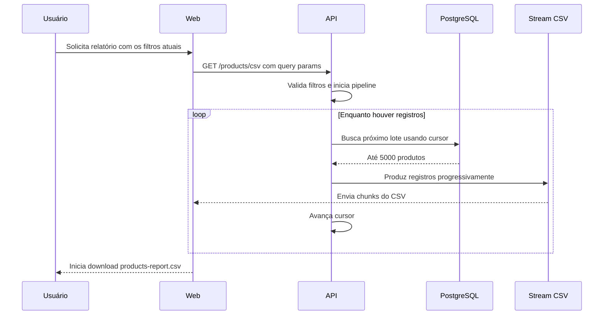

# ReportForge

Experimento sobre manipulação e processamento de grandes volumes de dados, utilizando um catálogo de 50.000 produtos para explorar paginação, processamento em lotes e exportação incremental de relatórios em CSV.

**Demo:** _em breve_ · **Post no Lab:** _em breve_

## Contexto

Trabalhar com poucos registros permite buscar os dados, mantê-los em memória e processá-los de uma vez. Esse modelo deixa de ser uma boa estratégia quando o volume cresce.

O ReportForge explora como diferentes operações sobre um mesmo dataset podem exigir estratégias diferentes. O experimento utiliza um catálogo de 200.000 produtos e trabalha com dois cenários.

Para a interface, não é necessário percorrer todos os 200.000 registros. O catálogo é consultado de forma paginada, trazendo apenas os registros necessários para representar a página atual. O usuário navega pelo conjunto gradualmente, sem receber todos os produtos de uma única vez.

Para a exportação, é necessário percorrer todo o conjunto correspondente aos filtros selecionados. Isso não significa que todos os registros precisam ser carregados simultaneamente em memória. A API utiliza cursor-based pagination, busca lotes de até 5000 produtos e envia os registros progressivamente para um stream CSV.

Dessa forma, o mesmo conjunto de dados é manipulado com estratégias diferentes de acordo com a operação realizada.

## Stack

### Web

| Tecnologia | Uso |
| ---------- | --- |
| React + TypeScript | Interface do catálogo |
| TanStack Query | Consultas, cache e estado assíncrono |
| nuqs | Filtros e paginação na URL |
| Axios | Cliente HTTP |
| Tailwind CSS | Estilização |
| Vite | Desenvolvimento e build |

### API

| Tecnologia | Uso |
| ---------- | --- |
| Express + TypeScript | API HTTP |
| csv-stringify | Transformação dos registros em CSV |
| Node.js Streams | Fluxo incremental dos dados |
| Prisma | Consultas e cursor-based pagination |
| PostgreSQL | Persistência do catálogo |
| Zod | Validação dos filtros e query params |

O monorepo é organizado com **pnpm workspaces**, contendo `apps/web` e `apps/api`.

## Fluxo de geração do relatório

A exportação percorre todos os produtos correspondentes aos filtros selecionados, mas não espera processar os 200.000 produtos para começar a responder. Assim que um lote é buscado no banco, seus produtos são entregues individualmente pelo async generator para o próximo estágio do pipeline.

O fluxo conceitual é:

```text
PostgreSQL
    ↓
cursor-based pagination
    ↓
lote de até 5000 produtos
    ↓
async generator
    ↓
registro individual
    ↓
csv-stringify
    ↓
Node.js Stream
    ↓
HTTP response
    ↓
products-report.csv
```

O `csv-stringify` funciona como uma transformação do stream:

```text
objeto JavaScript
        ↓
csv-stringify
        ↓
linha CSV
```

Exemplo conceitual:

```text
{
    sku: "SKU-000001",
    name: "Vega Air Air 00001",
    category: "Notebooks",
    price: "R$ 4.850,87",
    stock: 62,
    status: "Ativo"
}

↓

SKU-000001;Vega Air Air 00001;Notebooks;R$ 4.850,87;62;Ativo
```

### Async generator

A função responsável pela exportação não retorna um array contendo todo o relatório. Ela produz os registros progressivamente através de `yield`:

```text
busca lote
    ↓
yield produto 1
yield produto 2
yield produto 3
...
yield produto 5000
    ↓
busca próximo lote
```

O lote vindo do banco continua sendo um array normal. O async generator transforma a sequência desses lotes em uma sequência assíncrona de produtos que pode ser consumida pelo stream. O `yield` permite entregar cada registro para o próximo estágio sem criar um novo array contendo todo o relatório.

### Streams e pipeline

O fluxo conceitual do pipeline é:

```text
Async Generator
      ↓
Readable Stream
      ↓
CSV Transform
      ↓
HTTP Response
```

O async generator busca e produz os produtos. `Readable.from()` transforma esse `AsyncIterable` em um Readable Stream. O `csv-stringify` recebe os objetos e produz os dados CSV. A response HTTP é o destino final do stream. O `pipeline` conecta essas etapas para que os dados possam fluir progressivamente até o download.

### Backpressure

Imagine que o banco e a aplicação conseguem produzir dados mais rápido do que a conexão do usuário consegue recebê-los. Sem nenhum controle, a aplicação poderia continuar produzindo dados e acumulá-los em memória enquanto espera a rede.

Streams possuem um mecanismo de backpressure que permite diminuir a produção quando o consumidor não consegue acompanhar. No ReportForge, o pipeline e os streams do Node controlam esse fluxo:

```text
Banco / aplicação
      ↓ rápido

Stream
      ↓

Rede do usuário
      ↓ devagar
```

Quando o destino não consegue consumir mais dados naquele momento, o fluxo desacelera em vez de continuar acumulando indefinidamente. Ainda existe um lote de até 5000 produtos retornado pelo banco, mas o relatório completo de 50.000 registros não é materializado simultaneamente.

### Processamento em lotes

O tamanho atualmente utilizado para a geração do relatório é de 5000 produtos por consulta. Isso é diferente do tamanho do dataset:

```text
tamanho do dataset = até 50.000 produtos
tamanho do lote    = até 5.000 produtos
```

Para 50.000 produtos, conceitualmente podemos ter:

```text
consulta 1  → 1 - 5.000
consulta 2  → 5.001 - 10.000
consulta 3  → 10.001 - 15.000
...
consulta 10 → 45.001 - 50.000
```

Isso não significa que todos esses lotes ficam guardados. Depois que um lote é consumido, a aplicação pode avançar para o próximo.

### Cursor-based pagination

Cursor-based pagination é uma forma de percorrer um conjunto grande usando uma referência de posição, em vez de aumentar continuamente um offset. A aplicação guarda uma referência para o último registro processado e utiliza essa referência para continuar a partir dali na próxima consulta.

```text
consulta
1 2 3 4 5
        ↑
      cursor

próxima consulta
        ↓
6 7 8 9 10
```

Na exportação, esse cursor permite percorrer progressivamente todos os produtos filtrados em lotes sucessivos, sem utilizar offsets cada vez maiores durante a geração do relatório.

### CSV

O relatório representa essencialmente uma tabela com SKU, nome, categoria, preço, estoque e status. CSV é adequado para este experimento porque possui pouca sobrecarga e pode ser produzido sequencialmente. Não é necessário ter um documento inteiro em memória antes de começar a resposta.

CSV e PDF são formatos com objetivos diferentes. Um PDF tabular exige responsabilidades adicionais de apresentação, como layout, dimensões, quebra de páginas, posicionamento, fontes, cabeçalhos e rodapés. Como o objetivo do ReportForge é estudar o processamento de grandes volumes, o CSV concentra o experimento no fluxo dos dados.

### Compatibilidade com Excel

O CSV produzido usa `delimiter: ;`, codificação UTF-8 e UTF-8 BOM. Como os valores monetários em pt-BR utilizam vírgula decimal, como em `R$ 4.850,87`, o ponto e vírgula funciona melhor como separador das colunas. O UTF-8 BOM também ajuda programas como o Excel a reconhecer corretamente caracteres como `Preço`, `Acessórios` e `Memória`.



A diferença importante está em como o conjunto é percorrido. A consulta da interface trabalha apenas com uma página de cada vez, enquanto a exportação precisa visitar todos os registros correspondentes aos filtros. Nesse segundo caso, o cursor permite avançar pelo conjunto em lotes sucessivos, enquanto o async generator e os streams fazem os dados começarem a fluir para o usuário durante o processamento.

---

Construído por [Arthur Reis](https://buildwitharthur.com.br) como parte do [ArthurLabs Lab](https://arthurlabs.io).
