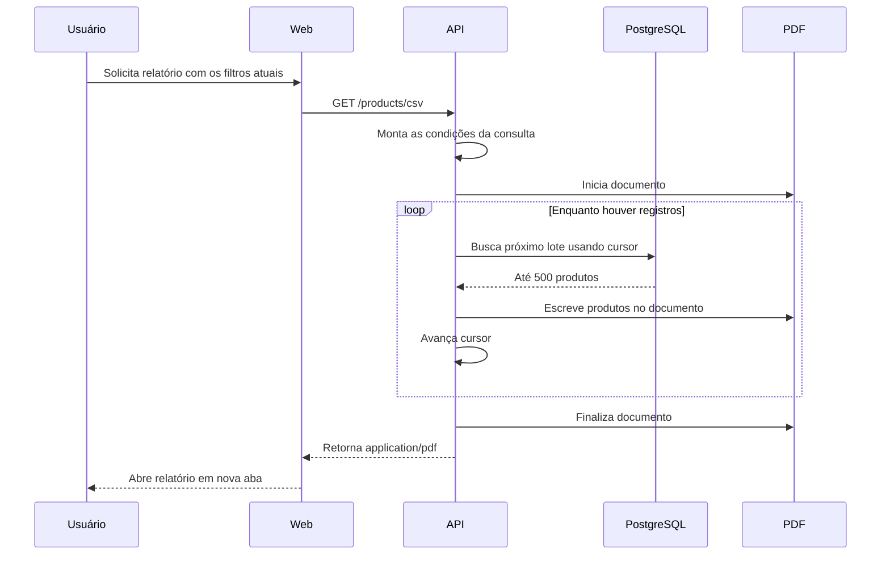

# ReportForge

Experimento sobre manipulação e processamento de grandes volumes de dados, utilizando um catálogo de 50.000 produtos para explorar paginação, processamento em lotes e geração progressiva de relatórios em CSV.

**Demo:** _em breve_ · **Post no Lab:** _em breve_

## Contexto

Trabalhar com poucos registros permite buscar os dados, mantê-los em memória e processá-los de uma vez. Esse modelo deixa de ser uma boa estratégia quando o volume cresce.

O ReportForge explora como diferentes operações sobre um conjunto maior de dados podem ser tratadas sem assumir que todo o dataset precisa estar disponível simultaneamente na aplicação. O experimento utiliza um catálogo de 50.000 produtos e trabalha com dois cenários.

Para visualização, o catálogo é consultado de forma paginada, trazendo apenas os registros necessários para a página atual. O usuário navega pelo conjunto gradualmente, sem receber todos os produtos de uma única vez.

Para geração do relatório, é necessário percorrer todo o conjunto correspondente aos filtros selecionados. Em vez de carregar esses registros de uma vez, a API utiliza paginação baseada em cursor e processa os produtos em lotes de até 5000 registros enquanto constrói o CSV.

Dessa forma, o mesmo conjunto de dados é manipulado com estratégias diferentes de acordo com a operação realizada.

## Stack

### Web

| Tecnologia | Uso |
| ---------- | --- |
| React + TypeScript | Interface do catálogo |
| TanStack Query | Consultas, cache e estado assíncrono |
| nuqs | Filtros e paginação na URL |
| Axios | Cliente HTTP |
| Tailwind CSS | Estilização |
| Vite | Desenvolvimento e build |

### API

| Tecnologia | Uso |
| ---------- | --- |
| Express + TypeScript | API HTTP |
| Prisma | Acesso ao banco e consultas |
| PostgreSQL | Persistência do catálogo |
| PDFKit | Construção e streaming do PDF |
| Zod | Validação dos query params |

O monorepo é organizado com **pnpm workspaces**, contendo `apps/web` e `apps/api`.

## Fluxo de geração do relatório

A geração do relatório percorre todos os produtos correspondentes aos filtros selecionados. Para evitar uma consulta que materialize todo o resultado de uma vez, a API utiliza paginação baseada em cursor e processa o conjunto em lotes de até 500 registros.

A diferença importante está em como o conjunto é percorrido. A consulta da interface trabalha apenas com uma página de cada vez, enquanto a geração do relatório precisa visitar todos os registros correspondentes aos filtros. Nesse segundo caso, o cursor permite avançar pelo conjunto em lotes sucessivos, evitando carregar os 50.000 produtos simultaneamente antes de começar a produzir o documento.

---

Construído por [Arthur Reis](https://buildwitharthur.com.br) como parte do [ArthurLabs Lab](https://arthurlabs.io).
